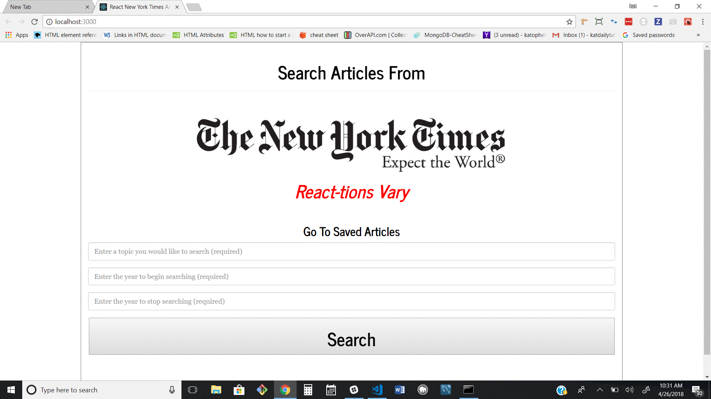

# NYT-React

NY Times React App 🗽
A NodeJS, MongoDB, Express, and React application where users can query,

 display, and save articles from the New York Times Article Search API. Users can remove saved articles as well.

Please check out the deployed version in Heroku here! https://nytimes-react-heroku.herokuapp.com/

Click on the headlines to be re-directed to the full New York Times articles.

Functionality
The app uses express to serve routes and mongoose to interact with a MongoDB database.

The app uses React for rendering components and axios for internal/external API calls.

Cloning down the repo
If you wish to clone the app down to your local machine...

Screenshots