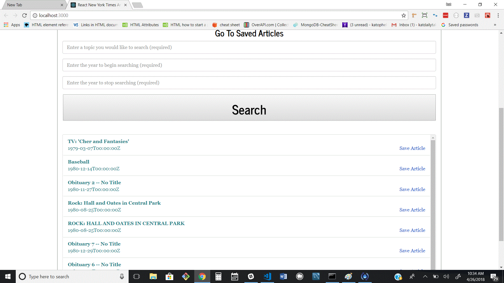
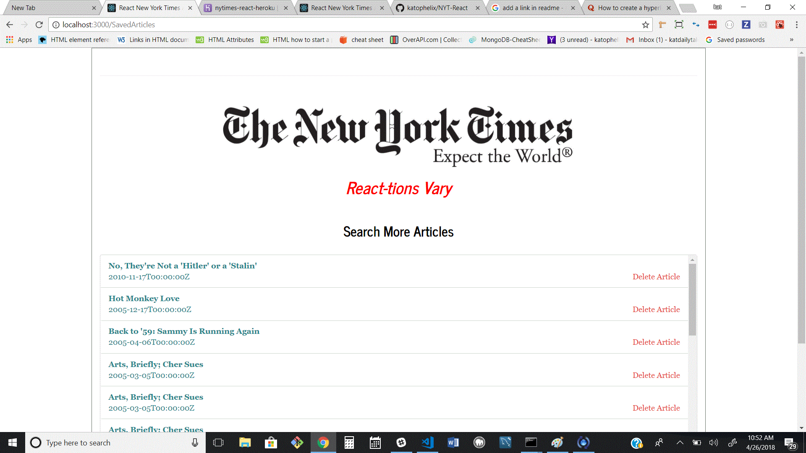

# NYT-React

## NY Times React App 
A NodeJS, MongoDB, Express, and React application where users can Search Articles from the New York Times.

### Search,

 ### Display, 
 
 

 ### Save 

  
 
 
 
 
 Users can remove saved articles as well.

Please check out the deployed version in Heroku  [Here](https://nytimes-react-heroku.herokuapp.com/) !

Click on the headlines to be re-directed to the full New York Times articles.

Functionality
The app uses express to serve routes and mongoose to interact with a MongoDB database.

The app uses React for rendering components and axios for internal/external API calls.
